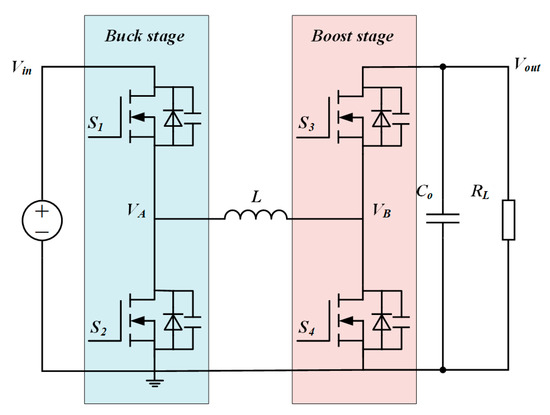
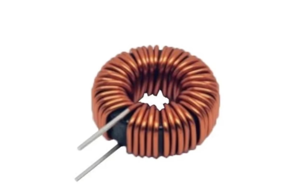

# ⚡ Bidirectional DC-DC Buck-Boost Converter with Digital Current Control

## 🚀 Design and Implementation for EV Applications

<p align="center">


</p>

---

# 📌 Overview

This project presents the **design, simulation, and partial hardware implementation** of a **Bidirectional DC-DC Buck-Boost Converter** with digital current control for EV and energy storage applications.

The converter is capable of operating in both:
- 🔽 Buck Mode
- 🔼 Boost Mode

using a **4-switch bidirectional topology** with complementary PWM switching.

The project includes:
- MATLAB/Simulink simulation
- Open-loop and closed-loop analysis
- STM32-based PWM generation
- Hardware implementation
- Current sensing and protection circuits
- Dead-time generation

The system demonstrates successful bidirectional energy transfer and smooth operation between modes.

---

# 👨‍💻 Author

**Kailash Chaudhary**  
Electrical Engineering

---

# 📚 Table of Contents

1. Introduction  
2. Objectives  
3. Converter Topology  
4. Design Specifications  
5. Operating Modes  
6. Inductor Design  
7. Capacitor Design  
8. Gate Driver & PWM  
9. Simulation Results  
10. Hardware Implementation  
11. Protection Features  
12. Challenges Faced  
13. Future Improvements  
14. Conclusion  

---

# 1️⃣ Introduction

Bidirectional DC-DC converters are widely used in:
- Electric Vehicles (EVs)
- Battery Energy Storage Systems
- Renewable Energy Systems
- DC Microgrids
- Regenerative Braking Systems

Unlike conventional converters, bidirectional converters allow:
- Source → Battery power flow
- Battery → Load power flow

This project implements a **non-isolated synchronous 4-switch buck-boost converter** capable of bidirectional power transfer with digital PWM control.

---

# 2️⃣ Objectives

✅ Design a bidirectional buck-boost converter  

✅ Analyze converter behavior in:
- Buck mode
- Boost mode

✅ Develop:
- Open-loop control
- Closed-loop current control

✅ Generate complementary PWM signals using STM32  

✅ Implement dead-time protection  

✅ Design:
- Inductor
- Capacitors
- MOSFET switching stage
- Current sensing circuits

✅ Validate converter operation using:
- MATLAB/Simulink
- Hardware testing

---

# 3️⃣ Converter Topology

## 🔷 4-Switch Bidirectional Buck-Boost Converter

The converter consists of:
- Four MOSFET switches
- Inductor
- Input capacitor
- Output capacitor
- Current sensing
- Gate driver circuitry

---

## 📷 Converter Circuit Diagram


<p align="center">
  
</p>


---

## Converter Operating Principle

The converter operates using four MOSFET switches with complementary PWM control.

### Buck Mode
- Input voltage is greater than battery/load voltage
- Converter steps down voltage
- Power flows from source to battery

### Boost Mode
- Battery voltage is boosted to higher output voltage
- Power flows from battery to load

### Key Features
✅ Bidirectional power flow  
✅ Complementary PWM switching  
✅ Dead-time protection  
✅ Reduced switching losses  
✅ High-frequency operation  

---

# 4️⃣ Design Specifications

| Parameter | Value |
|---|---|
| Converter Type | 4-Switch Bidirectional Buck-Boost |
| Rated Power | 200 W |
| Source Voltage | 48 V |
| Battery Voltage | 36 V Lithium-Ion |
| Switching Frequency | 50–75 kHz |
| PWM Type | Complementary PWM |
| Current Control | Digital |
| Controller | STM32F407 |
| Current Sensor | ACS712 |
| Gate Driver | A3120 / TLP250 |
| Control Method | Open-loop & Closed-loop |

---

# 5️⃣ Operating Modes

# 🔽 Buck Mode (Charging Battery)

When:

\[
V_{in} > V_{out}
\]

The converter operates in buck mode.

### Features
- Step-down operation
- Battery charging
- Controlled current flow

---

# 🔼 Boost Mode (Discharging Battery)

When:

\[
V_{out} > V_{in}
\]

The converter operates in boost mode.

### Features
- Step-up operation
- Bidirectional discharge
- Energy transfer to load

---

# 📷 Switching Waveforms


<p align="center">
  
</p>

---

# 6️⃣ Inductor Design

## Design Parameters

| Parameter | Value |
|---|---|
| Inductance | 300 µH |
| Current Rating | ≥ 15 A |
| Ripple Current | 30% |
| Core Type | Toroidal Ferrite Core |
| Switching Frequency | 50–75 kHz |

---

## Inductor Design Equation

\[
L=\frac{(V_{in}-V_{out})D}{\Delta I \times f_s}
\]

---

## 📷 Inductor Image


<p align="center">
  
</p>


---

# 7️⃣ Capacitor Design

## Output Capacitor Design

### Buck Mode Capacitor Equation

\[
C=\frac{\Delta I_L}{8f_s\Delta V_o}
\]

### Boost Mode Capacitor Equation

\[
C=\frac{I_{out}D}{f_s\Delta V_o}
\]

---

## Capacitor Specifications

| Capacitor | Value |
|---|---|
| Input Capacitor | 220–470 µF |
| Output Capacitor | 220–470 µF |
| Voltage Rating | 63–100 V |
| ESR | Low ESR |

---

# 8️⃣ Gate Driver & PWM

## Gate Driver Used

- A3120
- TLP250

### Features
✅ High-speed switching  
✅ Dead-time protection  
✅ Complementary PWM support  

---

# PWM Configuration

| Parameter | Value |
|---|---|
| PWM Frequency | 75 kHz |
| PWM Type | Complementary |
| Dead-Time | ~500 ns |
| Control | Digital PWM |

---

## 📷 Gate Driver Circuit

<p align="center">
  
</p>


---

# 9️⃣ Simulation Results

The converter was simulated using:
- MATLAB
- Simulink
- Simscape Electrical

---

## Simulation Features

The MATLAB/Simulink model includes:
- Open-loop converter analysis
- Closed-loop current control
- Complementary PWM generation
- Buck and boost mode validation
- Inductor current monitoring
- Voltage ripple analysis

---

# 📷 Simulink Model

```md

```

---

## Observed Results

✅ Stable buck operation  

✅ Stable boost operation  

✅ Proper complementary PWM switching  

✅ Smooth bidirectional current transfer  

✅ Dead-time implemented successfully  

---

# 🔟 Hardware Implementation

## Hardware Features

- STM32F407 controller
- MOSFET switching stage
- ACS712 current sensing
- Gate driver isolation
- Complementary PWM
- Protection circuitry

---

# 📷 Hardware Prototype

<p align="center">
  
</p>


---

## Hardware Components Used

| Component | Specification |
|---|---|
| MOSFET | IRFP250N / IRF3205 |
| Controller | STM32F407 |
| Current Sensor | ACS712 |
| Gate Driver | A3120 / TLP250 |
| Inductor | 100 µH Toroidal |
| Switching Frequency | 50–75 kHz |
| Battery Voltage | 36V Li-Ion |
| Source Voltage | 48V |

---

# 📷 Hardware Waveforms

<p align="center">
  
</p>

---

## Experimental Observations

- Stable complementary PWM pulses obtained
- Dead-time successfully implemented
- Proper buck mode operation verified
- Proper boost mode operation verified
- Smooth current transition observed
- Stable switching frequency achieved

---

# 1️⃣1️⃣ Protection Features

✅ Over-current shutdown  

✅ PWM dead-time protection  

✅ Fuse protection (10–15 A)  

✅ Current limiting  

---

## Protection Techniques Implemented

- PWM dead-time insertion
- Over-current shutdown
- Fuse-based protection
- Current limiting
- Gate driver isolation

---

# 1️⃣2️⃣ Challenges Faced

- Dead-time tuning
- MOSFET switching noise
- Inductor heating
- PWM synchronization
- Closed-loop tuning
- Hardware debugging
- Gate driver timing issues

---

# 1️⃣3️⃣ Future Improvements

🚀 Closed-loop hardware implementation  

🚀 PCB design  

🚀 Higher efficiency optimization  

🚀 Digital display & monitoring  

🚀 CAN communication  

🚀 Battery Management System integration  

🚀 Advanced current control algorithms  

---

## Possible Extensions

- DSP-based digital control
- MPPT integration
- Battery charging algorithms
- Real-time monitoring dashboard
- IoT connectivity
- Efficiency optimization using SiC MOSFETs

---

# 1️⃣4️⃣ Conclusion

A **Bidirectional Buck-Boost DC-DC Converter** was successfully designed, simulated, and partially implemented in hardware.

The project demonstrated:
- Stable buck operation
- Stable boost operation
- Complementary PWM generation
- Bidirectional energy transfer
- Successful transition from simulation to hardware

This project provided strong practical understanding of:
- Power electronics
- PWM switching
- Converter design
- Embedded control
- Hardware implementation

---

# 🛠️ Software Used

- MATLAB
- Simulink
- Simscape Electrical
- STM32CubeIDE

---

# 📖 References

1. Rashid — Power Electronics  
2. Erickson & Maksimovic — Fundamentals of Power Electronics  
3. Mohan — Power Electronics Converters  
4. STM32F407 Reference Manual  
5. Research Papers on Bidirectional DC-DC Converters  

---

# ⭐ If you like this project

Give this repository a ⭐ on GitHub.


